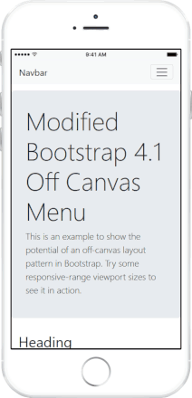

# Bootstrap 4 Off-Canvas Navigation

[Pascal Müller](https://github.com/trockendock) put together an off-canvas menu that replaces Bootstrap's standard slide down from the top menu for smaller screens (i.e. smartphones and tablets) with a slide in from the right menu.

This fork updates Pascal Müller's [offcanvas navigation](https://github.com/trockendock/bootstrap4-offcanvas-nav) from Bootstrap 4 - Alpha 6 to Bootstrap version 4.1.2 (*Verified with version 4.5.2*).

## Demo

[Demo page](https://richdebourke.github.io/bootstrap4-offcanvas-nav/) - resize the browser or view it on a mobile phone to see the menu operation.

## Built With

* [Bootstrap 4.1.2](https://getbootstrap.com/) *Verified with version 4.5.2*

## General operation

1. The main content (not including the footer) is wrapped in an off-canvas division
2. The toggle button toggles an off-canvas-active class on the wrapping division and displays a black overlay at 30% opacity
3. The off-canvas-active class transitions the position of the off-canvas division, the footer, and the menu
4. The menu can be closed by either clicking / tapping the toggle button or by clicking / tapping the visible portion of the overlay.

## Changes to Pascal Müller's version

* Change nav class from navbar-toggleable-sm to navbar-expand-md
    * Bootstrap switched to navbar-expand-*
    * *Use navbar-expand-md to have the off-canvas menu on tablets*
* Replaced nav class bg-faded with bg-light
    * Bootstrap switched to bg-gradient-*, but bg-gradient has to be enabled in the _variables.scss file, so I used bg-light
* Switched the order of navbar-brand and navbar-toggler - put the logo first
    * Bootstrap's toggler no longer uses position absolute – positioning is now done using flex
* Put the navbar content inside a container (so the menu can be on the right in large size displays)
* Added the same border color to `.off-canvas-right .sidebar-off-canvas` as is used for `.off-canvas-right.active .sidebar-off-canvas` (the border was starting out dark gray and transitioning to a lighter color)
* Changed the active class from `active` to `off-canvas-active` to make the class more unique
* Animated the toggle icon — *I prefer transitioning to an X so it's clearer to the user how to close the menu, if they decide to not click a link*
* Added an overlay to the body that will close the menu if tapped, darkens the body text, and covers any links that are visible.

## Breakpoint

The demo is setup to switch between the navbar menu and the off-canvas menu at 768px (iPad screen width in portrait mode). That can be reduced to 576px by changing the navbar class from `navbar-expand-md` to `navbar-expand-sm` and changing the media query in the css file from `max-width: 767.98px` to `max-width: 575.98px`. 

*It might be possible, using Scss, to have off-canvas-sm, -md, -lg, etc. classes that would manage the breakpoint, although the off-canvas size class would probably need to be manually coordinated with the navbar-expand-&ast; class.*

## Authors

* **Pascal Müller** - *Initial work* - [trockendock.io](https://github.com/trockendock)
* **Rich DeBourke** - *Update to work with Bootstrap V4.1.2* - [RichDeBourke](https://github.com/RichDeBourke)

## License

This code is provided under an MIT License. See the [LICENSE](https://github.com/RichDeBourke/bootstrap4-offcanvas-nav/blob/master/LICENSE) file for details.

## Updates

**2019/05/10** – Validated the site works with jQuery 3.4.1 and Bootstrap 4.3.1.

**2020/07/05** – Validated the site works with jQuery 3.5.1 and Bootstrap 4.5.0.

**2020/07/20** – Add an `aria-expanded` attribute to the navbar-toggler button with JavaScript to set the attribute to true when the menu is expanded.

**2020/09/13** – Added an overlay that covers the body content while the menu is displayed